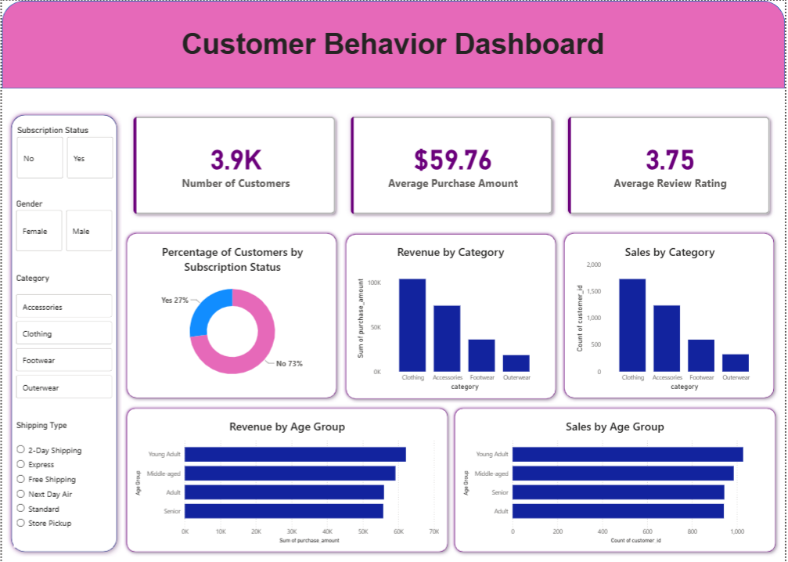

# 📊 Customer Shopping Behaviour Analysis


An end-to-end data analytics project that analyzes customer shopping behavior using Python, PostgreSQL, and Power BI. The project includes data loading, exploratory data analysis (EDA), data cleaning, SQL-based business analysis, interactive dashboard development, and comprehensive project documentation to generate actionable business insights.

## 📊 Dashboard Preview



## Overview

The **Customer Shopping Behavior Analysis** project demonstrates a complete data analytics workflow, transforming raw customer shopping data into meaningful business insights. The project includes data preprocessing in Python, exploratory data analysis (EDA), SQL-based analysis using PostgreSQL, interactive dashboard creation in Power BI, and documentation through a detailed project report and presentation.

The objective is to analyze customer purchasing behavior, identify trends, and present actionable insights that support data-driven business decisions.

---

## Dataset

The project uses a customer shopping behavior dataset containing transactional and demographic information.

The dataset was analyzed to:
- Understand customer demographics
- Explore purchasing patterns
- Identify sales trends
- Analyze product preferences
- Generate business insights through SQL and Power BI

---

## Tools & Technologies

- **Python**
  - Pandas
  - NumPy
  - Matplotlib
  - Seaborn

- **PostgreSQL**
  - SQL

- **Power BI**

- **Jupyter Notebook**

- **Gamma**
  - Presentation Creation

- **Microsoft Word**
  - Project Documentation

---

## Project Workflow

### 1. Data Loading
- Imported the dataset into Python using Pandas.
- Explored dataset structure, dimensions, and data types.
- Checked for missing values and inconsistencies.

### 2. Exploratory Data Analysis (EDA)
- Generated descriptive statistics.
- Visualized distributions of key variables.
- Identified customer purchasing patterns.
- Analyzed relationships between different features.
- Created charts to uncover trends and insights.

### 3. Data Cleaning
- Removed duplicate records.
- Handled missing values.
- Corrected data types.
- Standardized and prepared the dataset for analysis.

### 4. SQL Analysis (PostgreSQL)
- Imported the cleaned dataset into PostgreSQL.
- Executed SQL queries to answer business questions.
- Performed:
  - Filtering and sorting
  - Aggregations
  - Grouping
  - Conditional analysis
  - Business KPI calculations

### 5. Dashboard Development (Power BI)
Designed an interactive dashboard featuring:
- KPI Cards
- Sales Analysis
- Customer Demographics
- Product Category Insights
- Interactive Filters & Slicers
- Trend Visualizations

### 6. Documentation
- Prepared a detailed project report summarizing the methodology and findings.
- Created a professional presentation using Gamma to communicate key insights.

---

## Dashboard Highlights

The Power BI dashboard provides:

- Customer demographics overview
- Sales and revenue analysis
- Product category performance
- Customer purchase trends
- Interactive filtering for deeper analysis
- Business KPIs for decision-making

---

## Results

This project successfully:

- Cleaned and transformed raw customer shopping data.
- Performed comprehensive exploratory data analysis.
- Extracted business insights using PostgreSQL queries.
- Developed an interactive Power BI dashboard for visualization.
- Documented the complete analysis in a professional report.
- Created a presentation summarizing the project's objectives, methodology, and findings.

---

## Project Structure

```
Customer-Shopping-Behavior-Analysis/
│
├── Dataset/
│   └── customer_shopping_behavior.csv
│
├── Notebook/
│   └── Customer_Shopping_Behavior_Analysis.ipynb
│
├── SQL/
│   └── customer_behaviour_analysis_queries.sql
│
├── Dashboard/
│   └── customer_behavior_dashboard.pbix
│
├── Report/
│   └── Customer_Shopping_Behavior_Report.pdf
│
├── Presentation/
│   └── Customer_Shopping_Behavior_Presentation.pdf
│
├── Images/
│   └── dashboard_preview.png
│
└── README.md
```

---

## How to Run

### 1. Clone the Repository

```bash
git clone https://github.com/your-username/Customer-Shopping-Behavior-Analysis.git
```

### 2. Install Required Libraries

```bash
pip install pandas numpy matplotlib seaborn
```

### 3. Open the Jupyter Notebook

```bash
jupyter notebook
```

Run all notebook cells sequentially to perform data loading, cleaning, and exploratory data analysis.

### 4. Execute SQL Queries

- Import the cleaned dataset into PostgreSQL.
- Run the SQL script provided in the **SQL** folder to perform business analysis.

### 5. Explore the Dashboard

Open the `.pbix` file using **Power BI Desktop** to interact with the dashboard and explore insights.

---

## Key Skills Demonstrated

- Data Cleaning
- Exploratory Data Analysis (EDA)
- Data Visualization
- SQL Querying
- PostgreSQL
- Power BI Dashboard Development
- Business Intelligence
- Report Writing
- Data Storytelling
- Presentation Design

---

## Future Enhancements

- Integrate automated ETL pipelines.
- Develop predictive analytics models.
- Publish the dashboard to Power BI Service.
- Enable real-time data refresh.
- Build an interactive web dashboard for broader accessibility.

---

## Author

**Pratha Telang**

If you found this project useful, consider giving it a ⭐ on GitHub!
